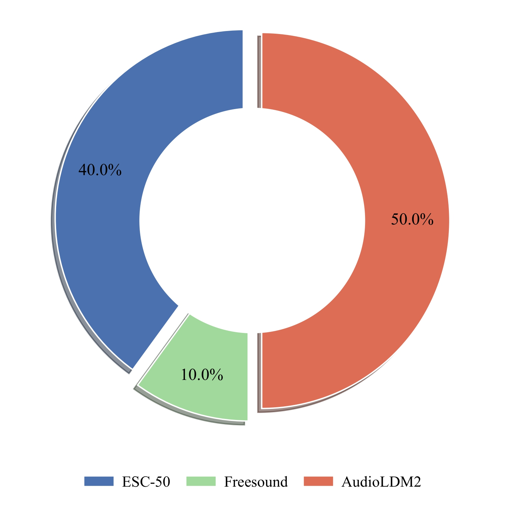

# ESC-FreeGen50

[Paper Code](https://github.com/Yuanbo2020/U-ART) 

The dataset described herein is based on the publicly available ESC-50 benchmark dataset, augmented with self-collected samples and samples synthesized through generative audio models.

## Data Composition

[ESC-50](https://github.com/karolpiczak/ESC-50) is a widely used benchmark dataset for environmental sound classification. It contains 2,000 labeled environmental audio recordings (each 5 seconds long, covering 50 semantic categories) and is suitable for the comparative evaluation of environmental sound classification methods.

Building upon the ESC-50 category system, the extended dataset constructed in this project retains the original 50 semantic definitions while expanding the sample size to 100 audio clips per category. The specific composition is as follows:

- **40 clips** derived from the original ESC-50 segments.
- **10 clips** manually selected from public field recordings such as Freesound.org.
- **50 clips** synthesized using AudioLDM2.

This composition adheres to the original specifications and has been verified through manual listening to ensure the sound features align with the semantic labels. To reduce label noise and interference from multiple events, each audio clip in the dataset is constrained to contain **one single salient audio event**. We utilized manual screening to strictly enforce this constraint.

## Data Sources

1. **ESC-50 Original Samples (40 clips/class)**
   - Original recording segments consistent with the category labels were directly adopted from ESC-50, retaining their original sampling rate and duration information (standard ESC-50 clips are 5 seconds). These samples serve as a real-world environmental sound baseline, providing a solid supervision signal for the model.
2. **Public Field Recordings (10 clips/class)**
   - Recordings matching the target category semantics were retrieved from open audio resources such as Freesound.org. These were manually screened and cropped to ensure **single-event dominance** (i.e., each segment contains only one primary audio event). The cropping process also ensured that the duration of the obtained clips matches that of the ESC-50 dataset. Basic cleaning (deduplication, noise level screening) and manual auditing were performed on these samples to guarantee semantic consistency and audio quality.
3. **Synthetic Samples (50 clips/class, using AudioLDM2)**
   - Using AudioLDM2 (based on pre-trained weights), audio clips of the corresponding duration were generated using the category labels as text prompts. The generated results underwent item-by-item manual listening to filter out samples with mismatched semantics or poor audio quality, retaining only those that met quality requirements. The pre-trained weights and model implementation used are available at the official AudioLDM repository (https://huggingface.co/cvssp/audioldm2). This synthesis process aims to expand the data diversity of each category.

## Data Split

To support model training, hyperparameter tuning, and fair evaluation, the dataset is divided according to the following ratios and sample sizes (Total sample size: 100 clips/class across 50 classes):

- **Training Set**: Total of 4,000 samples (50 classes × 80 clips/class). These samples are used for model parameter learning. The training set contains a mixture of the three sources mentioned above to ensure the model benefits from both the robustness of real recordings and the diversity brought by synthetic samples.
- **Validation Set**: Total of 500 samples (50 classes × 10 clips/class). Used for hyperparameter tuning and early stopping determination.
- **Test Set**: Total of 500 samples (50 classes × 10 clips/class). Used for final performance evaluation. The samples in the test set are independent of the training/validation sets in terms of semantics and specific sources to minimize evaluation bias.
